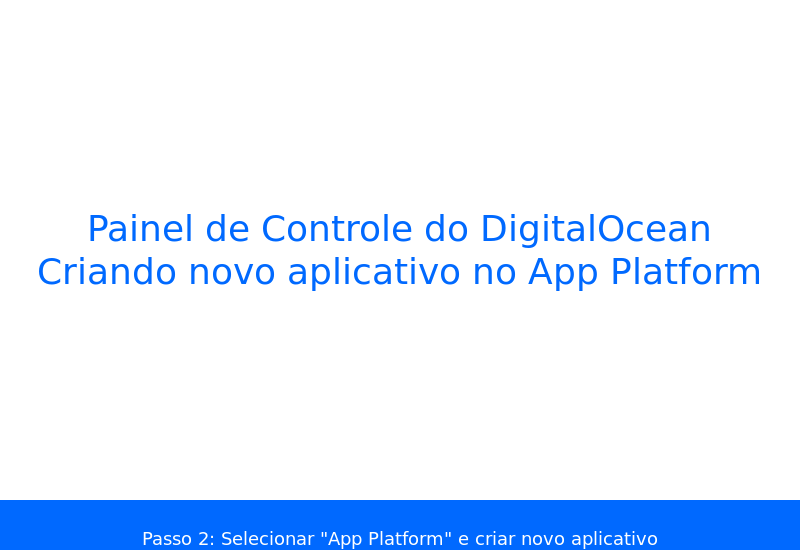
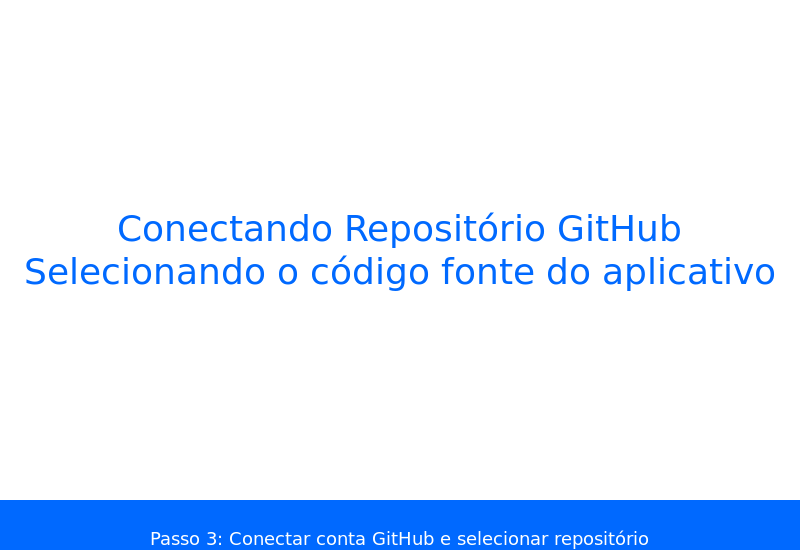
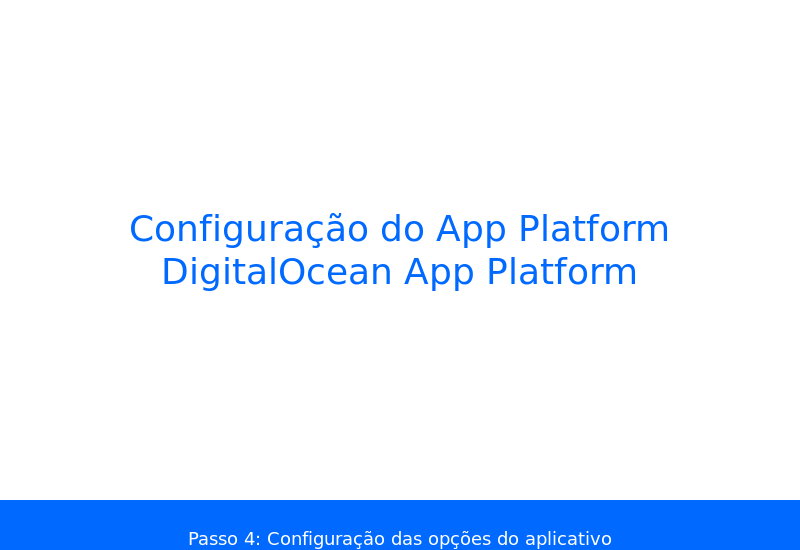
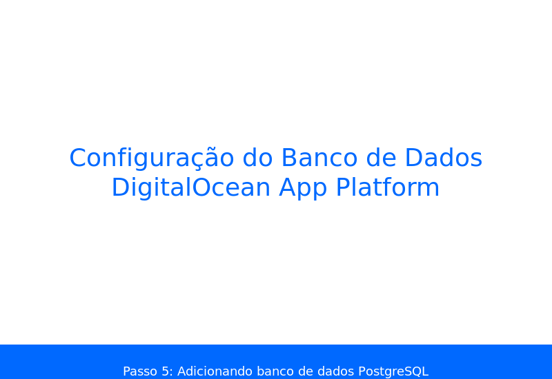
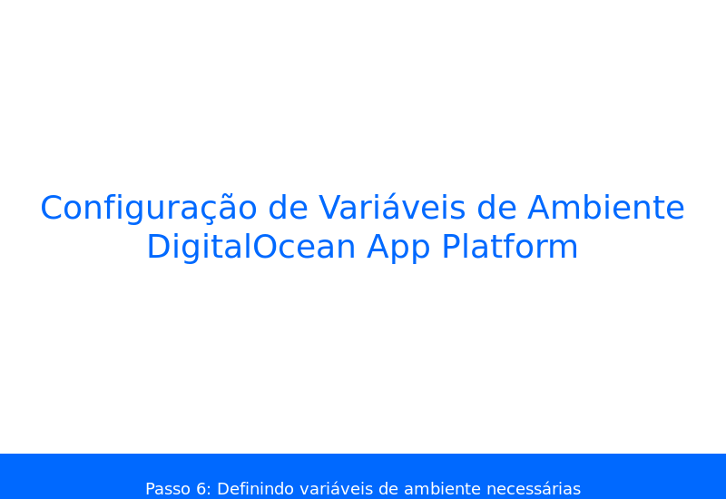
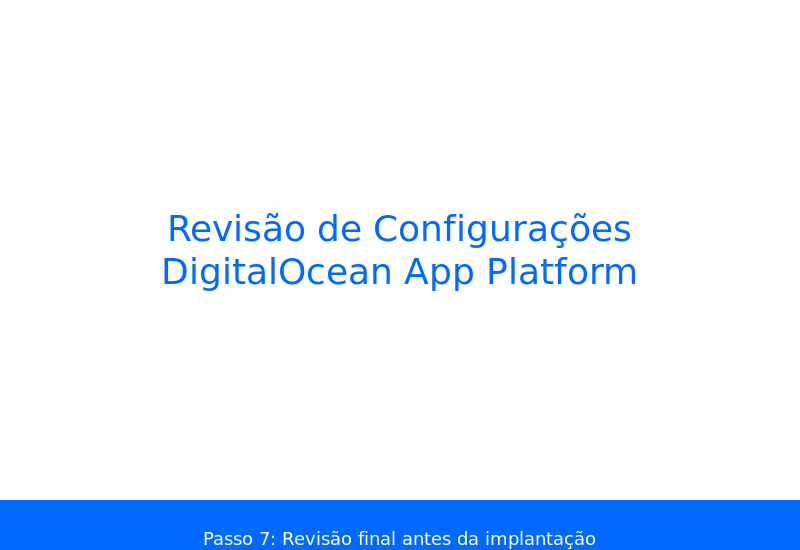
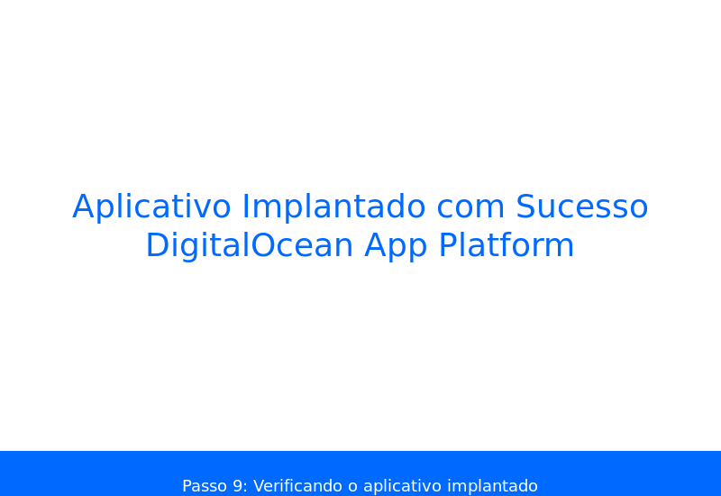
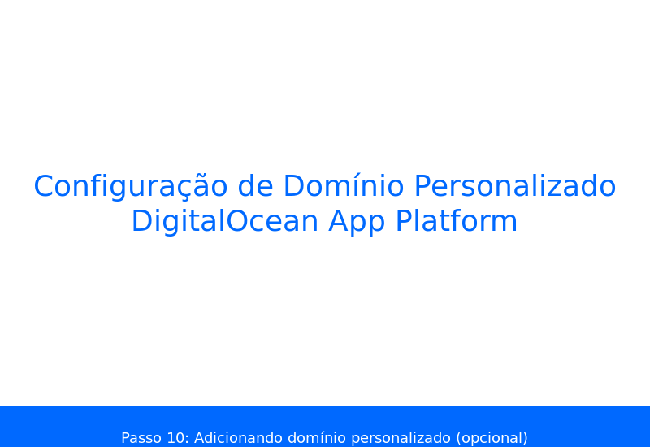

# Guia Completo de Hospedagem do Jogo do Bicho no DigitalOcean


## Introdução

Este guia detalhado irá mostrar como realizar a hospedagem do sistema de Jogo do Bicho na plataforma DigitalOcean, desde o processo de download dos arquivos até a configuração completa e funcionamento do site.

## Pré-requisitos

1. Uma conta na DigitalOcean (você precisará de um cartão de crédito para criar uma conta)
2. Conhecimentos básicos de linha de comando
3. Acesso ao código-fonte do seu projeto no Replit

## Índice

1. Baixando os arquivos do Replit
2. Criando uma conta na DigitalOcean
3. Configurando o App Platform
4. Configurando o banco de dados PostgreSQL
5. Configurando variáveis de ambiente
6. Implantando a aplicação
7. Configurando domínio personalizado (opcional)
8. Monitoramento e manutenção

## 1. Baixando os arquivos do Replit

### 1.1. Exportando o código do Replit

1. Abra seu projeto no Replit
2. No canto inferior esquerdo, clique nos três pontos (...) ao lado do nome do seu repl
3. Selecione "Download as zip"
4. Salve o arquivo .zip em seu computador
5. Extraia o arquivo .zip para uma pasta em seu computador

### 1.2. Verificando a estrutura do projeto

Após extrair, você deverá ter uma estrutura semelhante a esta:

```
/seu-projeto/
  /client/
  /server/
  /shared/
  package.json
  package-lock.json
  ... (outros arquivos)
```

Certifique-se de que todos os arquivos essenciais estão presentes.

## 2. Criando uma conta na DigitalOcean

### 2.1. Registro na plataforma

1. Acesse [https://www.digitalocean.com/](https://www.digitalocean.com/)
2. Clique em "Sign Up" no canto superior direito
3. Preencha seus dados e informações de pagamento
4. Verifique seu e-mail e ative sua conta

### 2.2. Configurando método de pagamento

1. Após o login, vá para "Billing" na barra lateral
2. Adicione um cartão de crédito se ainda não o fez
3. Você receberá créditos gratuitos para novos usuários (geralmente $100 por 60 dias)

## 3. Configurando o App Platform

### 3.1. Criando um repositório Git

Antes de prosseguir, é necessário colocar seu código em um repositório Git (GitHub, GitLab, etc.):

1. Crie uma conta no GitHub se ainda não tiver: [https://github.com/](https://github.com/)
2. Crie um novo repositório
3. Na pasta local do seu projeto, inicialize um repositório Git:

```bash
git init
git add .
git commit -m "Versão inicial"
git branch -M main
git remote add origin https://github.com/seu-usuario/seu-repositorio.git
git push -u origin main
```

### 3.2. Criando um aplicativo no App Platform

1. No painel da DigitalOcean, clique em "Create" no canto superior direito
2. Selecione "Apps" na lista de opções



3. Escolha o repositório Git onde você armazenou o código
   - Você precisará conectar sua conta GitHub/GitLab à DigitalOcean
   - Selecione o repositório que contém o código
   - Escolha a branch (geralmente "main")



### 3.3. Configurando o aplicativo

1. Na tela de configuração, o DigitalOcean tentará detectar automaticamente o tipo de aplicativo
2. Confirme que é um aplicativo "Node.js"
3. Defina o diretório raiz como "/" (raiz do repositório)
4. Configure o comando de build: `npm install && npm run build`
5. Configure o comando de execução: `node server/index.js`
6. Defina o HTTP port como "5000" (porta que o servidor Express usa)



## 4. Configurando o banco de dados PostgreSQL

### 4.1. Adicionando um componente de banco de dados

1. Na mesma tela de configuração do App Platform, role para baixo e clique em "Add Component"
2. Selecione "Database"
3. Escolha "PostgreSQL"
4. Selecione um plano que atenda às suas necessidades (o plano básico é suficiente para começar)



### 4.2. Conectando o banco de dados ao aplicativo

1. Após adicionar o componente de banco de dados, a DigitalOcean criará automaticamente uma variável de ambiente `DATABASE_URL`
2. Certifique-se de que esta variável está listada na seção "Environment Variables"

## 5. Configurando variáveis de ambiente

### 5.1. Adicionando variáveis necessárias

Na seção "Environment Variables", adicione as seguintes variáveis:

1. `NODE_ENV` = `production`
2. `SESSION_SECRET` = `[gere uma string aleatória longa]`
3. `PUSHIN_PAY_TOKEN` = `[seu token do gateway de pagamento]`

Para gerar uma string aleatória para SESSION_SECRET, você pode usar:
```bash
node -e "console.log(require('crypto').randomBytes(32).toString('hex'))"
```



### 5.2. Verificando todas as variáveis

Certifique-se de que todas as variáveis necessárias estão configuradas. A lista completa deve incluir:

- `DATABASE_URL` (automaticamente criada pelo DigitalOcean)
- `NODE_ENV`
- `SESSION_SECRET`
- `PUSHIN_PAY_TOKEN`
- `PGHOST` (automaticamente criada)
- `PGPASSWORD` (automaticamente criada)
- `PGUSER` (automaticamente criada)
- `PGDATABASE` (automaticamente criada)
- `PGPORT` (automaticamente criada)

## 6. Implantando a aplicação

### 6.1. Revisando e confirmando a implantação

1. Revise todas as configurações na tela de resumo
2. Escolha a região mais próxima do seu público-alvo (provavelmente Brasil)
3. Defina um nome para seu aplicativo
4. Verifique o custo estimado mensal
5. Clique em "Launch App" para iniciar a implantação



### 6.2. Monitorando o processo de implantação

1. O DigitalOcean iniciará o processo de implantação
2. Você pode acompanhar o progresso na página do aplicativo
3. A implantação pode levar de 5 a 15 minutos


### 6.3. Verificando a implantação

1. Quando a implantação for concluída, você verá um status "Running"
2. Clique no URL gerado pelo DigitalOcean para acessar seu aplicativo
3. Verifique se o site está funcionando corretamente



## 7. Configurando domínio personalizado (opcional)

### 7.1. Adicionando um domínio

1. Na página do seu aplicativo, vá para a guia "Settings"
2. Role até a seção "Domains"
3. Clique em "Add Domain"
4. Digite seu nome de domínio (ex: "jogodubicho.com.br")



### 7.2. Configurando registros DNS

1. O DigitalOcean fornecerá instruções sobre como configurar seus registros DNS
2. Você precisará adicionar um registro CNAME ou A no seu provedor de DNS
3. Aponte o registro para o domínio fornecido pelo DigitalOcean
4. A propagação DNS pode levar até 48 horas

### 7.3. Habilitando HTTPS

1. Após a verificação do domínio, o DigitalOcean configurará automaticamente um certificado SSL
2. Você não precisa fazer nada extra para habilitar HTTPS

## 8. Monitoramento e manutenção

### 8.1. Monitorando o desempenho

1. Na página do seu aplicativo, vá para a guia "Insights"
2. Visualize métricas de CPU, memória e requisições
3. Configure alertas para ser notificado sobre problemas

### 8.2. Configurando implantação contínua (opcional)

1. Por padrão, novas implantações são acionadas quando você faz push para a branch principal
2. Você pode configurar isso nas configurações do aplicativo

### 8.3. Fazendo backup do banco de dados

1. Na página do banco de dados PostgreSQL, vá para "Backups"
2. Configure backups automáticos
3. Você também pode fazer backups manuais quando necessário

## 9. Inicialização do banco de dados

### 9.1. Executando o script de inicialização

Após a implantação inicial, você precisará inicializar o banco de dados:

1. No painel do App Platform, vá para a guia "Console"
2. Digite o seguinte comando para acessar o console do seu aplicativo:

```bash
npm run db:push
```

Isso executará o script Drizzle para criar as tabelas necessárias no banco de dados.

### 9.2 Verificando as tabelas do banco

Verifique se as tabelas foram criadas corretamente:

```bash
psql $DATABASE_URL -c "\dt"
```

## Considerações finais

### Custos

- O plano básico do App Platform custa aproximadamente $5/mês
- O banco de dados PostgreSQL básico custa aproximadamente $15/mês
- Custo total estimado: $20-25/mês

### Escalabilidade

- Você pode facilmente aumentar os recursos do seu aplicativo conforme necessário
- O App Platform oferece escalonamento automático para lidar com picos de tráfego

### Suporte

- DigitalOcean oferece suporte via ticket e uma extensa documentação
- A comunidade DigitalOcean também é muito ativa em fóruns e no StackOverflow

## Problemas comuns e soluções

### Erro de conexão com o banco de dados

- Verifique se a variável DATABASE_URL está correta
- Certifique-se de que o banco de dados está rodando
- Verifique os logs para mensagens de erro específicas

### Aplicativo não inicia

- Verifique os logs do aplicativo na guia "Logs"
- Certifique-se de que todas as variáveis de ambiente estão configuradas
- Verifique se o comando de start está correto

### Problemas com pagamentos

- Verifique se o token PUSHIN_PAY_TOKEN está configurado corretamente
- Certifique-se de que o gateway de pagamento está ativo
- Verifique os logs para mensagens de erro específicas

---

Este guia deve ajudá-lo a hospedar com sucesso seu sistema de Jogo do Bicho na plataforma DigitalOcean. Se você encontrar problemas específicos, consulte a documentação oficial da DigitalOcean ou entre em contato com o suporte.